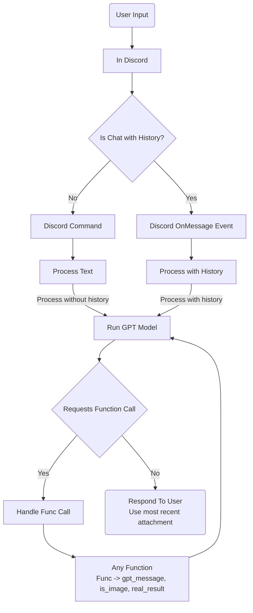

Planning diagrams for libraries here

## ChatGPT Integration with function calling

```mermaid
graph TD;
    UserInput(User Input) --> InDiscord[In Discord]
    InDiscord --> IsChatWithHistory{Is Chat with History?}
    IsChatWithHistory -- No --> DiscordCommand[Discord Command]
    IsChatWithHistory -- Yes --> DiscordOnMessage[Discord OnMessage Event]
    DiscordCommand --> ProcessText[Process Text]
    DiscordOnMessage --> ProcessWithHistory[Process with History]
    ProcessText -- Process without history --> RunGPT[Run GPT Model]
    ProcessWithHistory -- Process with history --> RunGPT[Run GPT Model]
    RunGPT --> RequestsFuncCall{Requests Function Call}
    RequestsFuncCall -- Yes --> HandleFuncCall[Handle Func Call]
    RequestsFuncCall -- No --> RespondToUser(Respond To User\nUse most recent attachment)
    HandleFuncCall --> AnyFunc[Any Function\nFunc -> gpt_message, is_image, real_result]
    AnyFunc --> RunGPT
```
