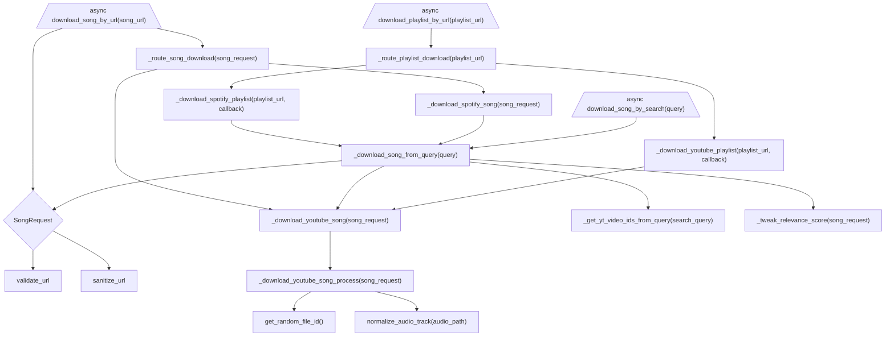

```mermaid
graph TD;
    %% The main functions being called by the user/discord
    download_playlist_by_url[/"async download_playlist_by_url(playlist_url)"\]
    download_song_by_url[/"async download_song_by_url(song_url)"\]
    download_song_by_search[/"async download_song_by_search(query)"\]
    
    %% Things for the song requests
    SongRequest{SongRequest}
    validate_url[validate_url]
    sanitize_url[sanitize_url]
    SongRequest --> validate_url
    SongRequest --> sanitize_url
    
    %% Things for general song downloading
    _route_song_download["_route_song_download(song_request)"]
    _route_playlist_download["_route_playlist_download(playlist_url)"]
    _download_youtube_song["_download_youtube_song(song_request)"]
    _download_youtube_song_process["_download_youtube_song_process(song_request)"]
    _download_spotify_song["_download_spotify_song(song_request)"]
    _download_youtube_playlist["_download_youtube_playlist(playlist_url, callback)"]
    _download_spotify_playlist["_download_spotify_playlist(playlist_url, callback)"]
    
    _get_yt_video_ids_from_query["_get_yt_video_ids_from_query(search_query)"]
    _download_song_from_query["_download_song_from_query(query)"]
    _tweak_relevance_score["_tweak_relevance_score(song_request)"]
    normalize_audio_track["normalize_audio_track(audio_path)"]
    get_random_file_id["get_random_file_id()"]
    
    %% Connections
    download_song_by_url --> _route_song_download
    download_playlist_by_url --> _route_playlist_download
    _route_playlist_download --> _download_spotify_playlist
    _route_playlist_download --> _download_youtube_playlist
    _download_spotify_playlist --> _download_song_from_query
    _download_song_from_query --> _get_yt_video_ids_from_query
    _download_song_from_query --> _tweak_relevance_score
    _route_song_download --> _download_spotify_song
    _route_song_download --> _download_youtube_song
    _download_youtube_song --> _download_youtube_song_process
    _download_youtube_song_process --> get_random_file_id
    _download_youtube_song_process --> normalize_audio_track
    _download_spotify_song --> _download_song_from_query
    download_song_by_search --> _download_song_from_query
    download_song_by_url --> SongRequest
    _download_song_from_query --> SongRequest
    _download_song_from_query --> _download_youtube_song
    _download_youtube_playlist --> _download_youtube_song
    
    
    
```
